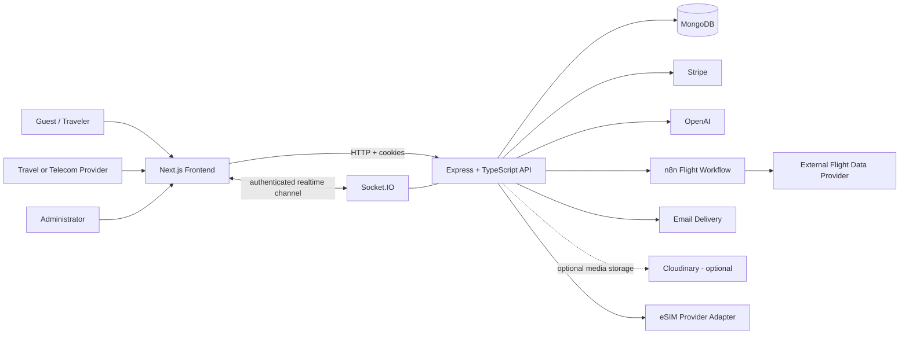
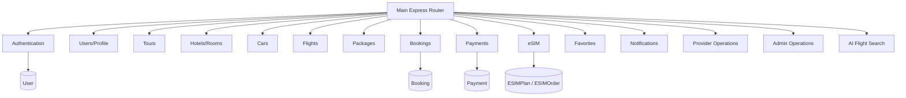
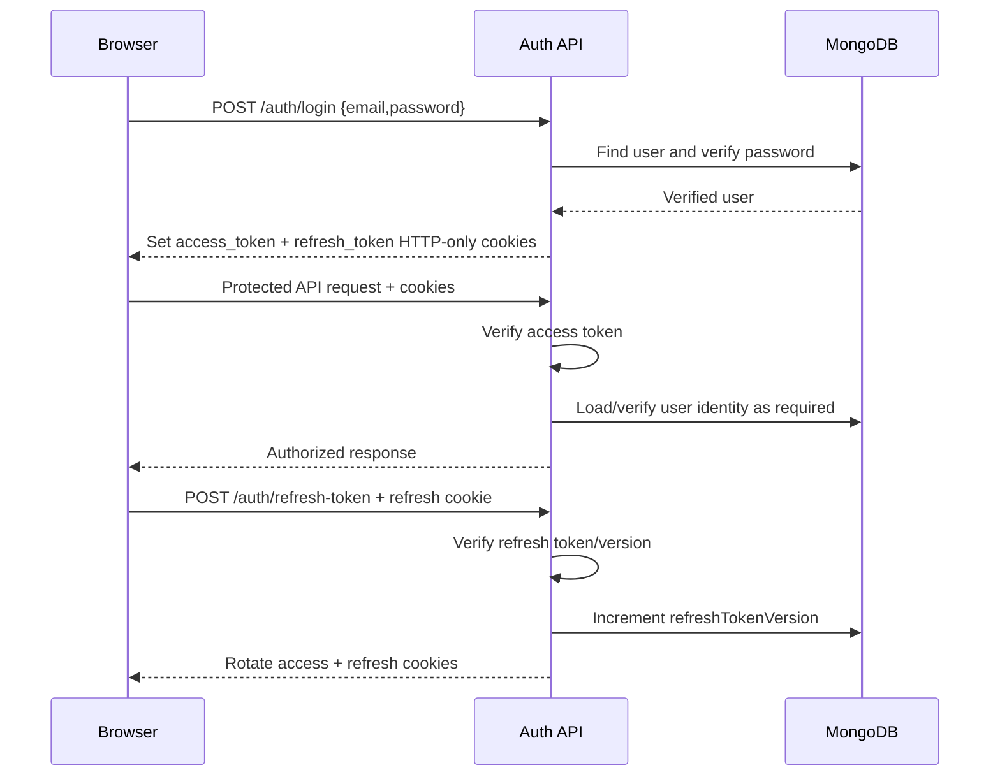
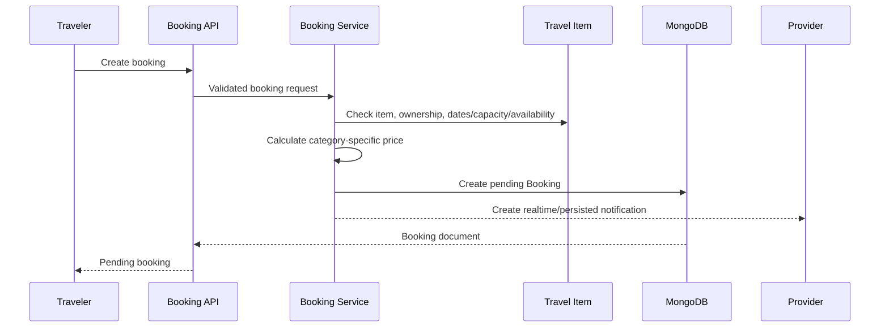
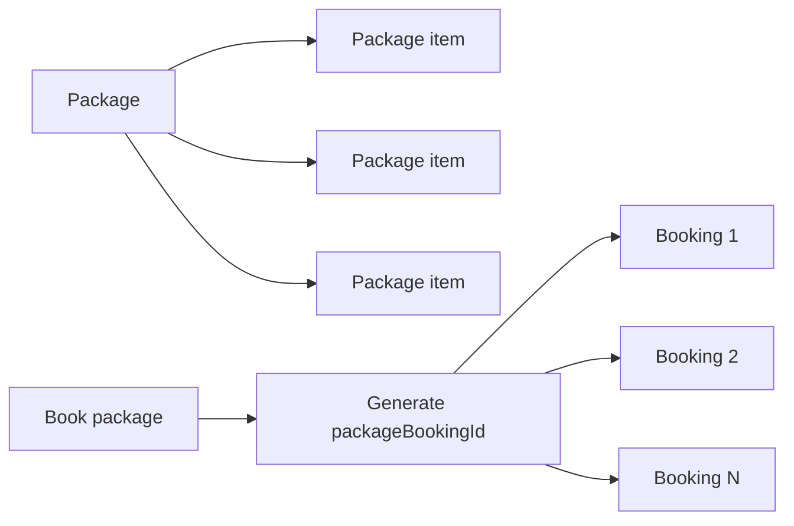
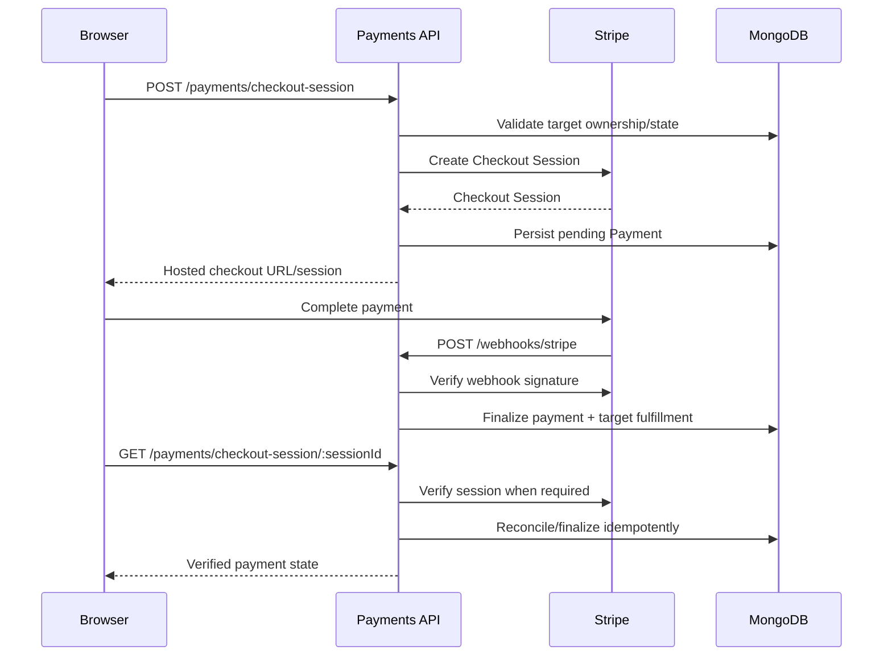
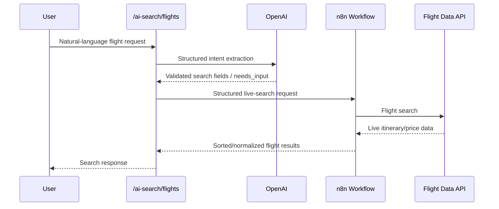
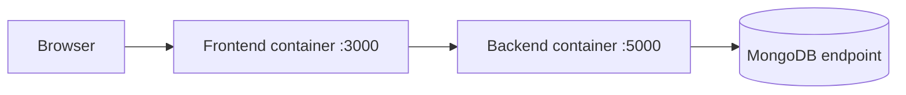

# SAFARNI System Architecture

**Verification basis:** current frontend/backend hardening branches, backend routes/services, environment examples, Docker/Kubernetes configuration, database models, and implemented integration adapters.

**Purpose:** implementation-grounded architecture reference for graduation documentation and technical discussion. External services are described as configured/integrated in code; this file does not claim a production deployment unless separately validated.

## 1. Architectural style

SAFARNI is a full-stack travel marketplace with a browser-based Next.js frontend and an Express/TypeScript backend. The backend exposes REST-oriented APIs, maintains authenticated HTTP and Socket.IO sessions, persists domain data in MongoDB through Mongoose, and coordinates external services such as Stripe and the AI flight-search workflow.

Primary application layers:

1. Presentation layer - Next.js customer/provider/admin interfaces.
2. API and security layer - Express routing, validation, authentication, authorization, rate limiting, audit logging and global error handling.
3. Domain/service layer - travel inventory, bookings, packages, payments, eSIM, provider operations, admin operations, notifications and AI search.
4. Persistence layer - MongoDB/Mongoose.
5. Integration layer - Stripe, OpenAI, n8n live-flight workflow, optional Cloudinary upload storage, email delivery, and the pluggable eSIM provider abstraction.
6. Deployment layer - Docker images and Kubernetes manifests on the hardening branch; no production cloud provider is asserted by this document.

## 2. System context



## 3. Frontend architecture

The frontend is implemented with Next.js 16.3 and React. The verified application routes include customer travel browsing/detail pages, authentication flows, checkout, eSIM, AI search, profile/favorites/bookings/notifications, provider dashboards/operations, and admin dashboards/management pages.

The frontend communicates with the backend through `NEXT_PUBLIC_API_URL`. Authenticated browser requests rely on the backend's HTTP-only cookies, so cross-origin development/runtime configuration must preserve credentials.

The frontend production build has been independently verified locally and in GitHub Actions. The Docker image exposes port 3000.

## 4. Backend application architecture

The backend is Express 5 + TypeScript. `server.ts` creates an HTTP server, initializes Socket.IO on the same server, connects to MongoDB, and then starts listening on `PORT`.

Important cross-cutting middleware includes:

- Helmet security headers
- CORS restricted to configured `FRONTEND_URL`
- cookie parsing
- global IP rate limiting
- stricter authentication-route rate limiting
- request validation with Zod
- access-token authentication
- role and provider-type authorization
- audit logging
- centralized not-found handling
- centralized error handling
- raw-body handling for Stripe webhooks

The configured Docker runtime uses port 5000.

## 5. Backend module map



## 6. Authentication and session architecture

SAFARNI uses signed token-based sessions carried in HTTP-only cookies.



Security characteristics verified in source:

- access and refresh cookies are `httpOnly`
- `SameSite=Lax`
- `Secure` is enabled in production
- refresh-token versioning supports revocation/rotation
- password-reset and email-verification tokens are stored hashed
- user login requires verified email
- passwords are not serialized from the User model

Socket.IO authenticates connections from the same `access_token` cookie and joins each authenticated user to a private room keyed by user ID.

## 7. Marketplace approval architecture

Travel/telecom providers create inventory, while administrators control approval.

Common provider-owned models use:

```text
createdBy -> User
updatedBy -> User
status -> pending | approved | rejected
```

This pattern is used for Tours, Hotels, Cars, Flights, Packages and eSIM Plans. Public list/detail services generally expose approved inventory, while provider/admin paths support management and moderation.

Provider specialization is represented by `providerType`:

- `travel`
- `telecom`
- `both`

Travel inventory creation is restricted to travel/both providers. eSIM plan creation is restricted to telecom/both providers.

## 8. Booking architecture

Bookings use one shared `Booking` model across tours, flights, cars and hotels. `category` tells the service how to interpret the polymorphic `itemId`.



Verified booking safeguards include:

- date-order validation
- room/car overlap checks
- tour capacity checks
- flight seat checks and seat decrement
- concurrency lock scoped to the bookable item during read-then-write operations
- provider ownership enforcement for booking status changes
- payment-success middleware before confirmation
- cancellation logic and refund attempt

## 9. Package-booking architecture

A Package stores references to multiple travel items and a discount percentage. When the customer books a package, the service creates individual Booking documents with the same generated `packageBookingId`.



The implementation attempts all-or-nothing application behavior: if a later item fails during package creation, previously created bookings in that operation are soft-rolled back/cancelled, with flight seats restored where applicable.

There is no separate PackageBooking Mongoose model.

## 10. Stripe payment architecture

The payment layer supports Stripe Hosted Checkout and Payment Intent flows. Payment records can target exactly one of:

- individual booking
- package booking group
- eSIM order



Stripe webhook events handled in source include checkout completion/async success, payment-intent success, and payment-intent failure.

## 11. eSIM architecture

The eSIM module is designed behind a provider interface/factory. The current implementation contains a `mock-esim.provider.ts`; therefore the project has a working provider abstraction and internal provisioning flow, but **a real carrier/eSIM vendor integration is not verified**.

The business flow is:

1. Telecom provider/admin creates eSIM plan.
2. Admin approves plan.
3. Customer creates an eSIM order.
4. Customer pays the `esimOrderId` through Payments.
5. Successful payment triggers/requires provisioning.
6. Order stores a snapshot of purchased plan data and provisioned profile data.
7. Customer can inspect order and activate the profile through the application workflow.

A future real carrier adapter can implement the existing provider interface without changing the main eSIM domain model.

## 12. AI-assisted live flight search architecture

The implemented AI search path separates natural-language interpretation from external fare retrieval.



Architectural rule: the AI layer interprets trip intent; it is not the source of flight fares. Live pricing is expected from the n8n/external-flight path.

Source-code implementation is verified. A complete live external end-to-end run should be treated as separate runtime evidence.

## 13. Notification architecture

SAFARNI combines persisted notifications and Socket.IO delivery.

- Notification records are stored per `userId`.
- API supports paginated retrieval, unread count, single-read and read-all operations.
- Socket.IO authenticates the user using the access-token cookie.
- Each user joins a private room named with their user ID.
- Booking and approval services can send provider/customer notifications through the notification helper.

## 14. Media/upload architecture

The backend upload layer supports optional Cloudinary configuration. When Cloudinary is not configured, development uploads fall back to a local upload directory that is exposed under `/uploads`.

This architecture is useful for development and demonstrations, but production persistence should use durable external/object storage rather than relying on container-local disk.

## 15. Email architecture

Authentication uses email for verification and password reset. The backend builds verification/reset URLs using `FRONTEND_URL`.

Development code can expose verification/reset URLs to the console when email infrastructure is intentionally not configured. Production behavior therefore depends on valid email transport configuration and should be validated separately before claiming production email delivery.

## 16. Container architecture

Verified Docker images exist for both applications:



Both Docker builds have been exercised locally, and both Docker build steps also passed in GitHub Actions.

## 17. Kubernetes architecture

The hardening branch includes Kubernetes manifests for:

- namespace
- backend ConfigMap
- backend Deployment
- backend Service
- frontend Deployment
- frontend Service
- external backend Secret creation example
- Kustomize configuration

The backend readiness/liveness probes use the real `GET /` API status endpoint. Secrets are deliberately excluded from committed YAML and must be created out-of-band.

Kubernetes source/manifests and local rendering should be distinguished from a verified production cluster deployment.

## 18. CI architecture

Both repositories now contain GitHub Actions validation workflows.

Backend CI performs:

- checkout
- Node.js 24 setup
- clean `npm ci`
- production dependency audit
- TypeScript build
- Docker image build

Frontend CI performs:

- checkout
- Node.js 24 setup
- clean `npm ci`
- production dependency audit
- TypeScript type check
- Next.js production build
- Docker image build

The first verified runs of both workflows completed successfully.

Automated application unit/integration test coverage must not be overstated: the backend's generic `npm test` remains a placeholder, while a legacy tours Postman/Newman asset is not representative of the complete current API.

## 19. Security boundaries

Verified architectural security controls include:

- HTTP-only token cookies
- refresh-token rotation/versioning
- email verification before login
- password hashing
- hashed reset/verification tokens
- role-based authorization
- provider-type authorization
- resource ownership checks in domain services
- Zod validation on many mutation routes
- Helmet
- CORS with credentials and configured frontend origin
- general and authentication/AI-specific rate limiting
- Stripe webhook signature verification with raw body
- payment gate before booking confirmation
- audit logging without request-body logging
- user-scoped Socket.IO authentication/rooms
- Docker non-root runtime configuration
- Kubernetes non-root/security-context controls

Security scanner results should be added to project evidence only after the current Gitleaks/Semgrep/Trivy run completes with correctly captured scanner exit codes.

## 20. Current architecture boundaries / not-yet-proven items

Do not present the following as completed production capabilities without additional evidence:

- real eSIM carrier integration (current provider is mock)
- production cloud hosting/provider
- production domain/URLs
- production MongoDB cluster topology
- production registry/image digest publication
- live Kubernetes cluster deployment unless runtime validation proves it
- Terraform infrastructure unless an actual target/provider is selected and validated
- complete automated unit/integration test suite
- complete live OpenAI -> n8n -> external flight-provider end-to-end evidence if not separately executed

These boundaries keep the graduation documentation aligned with the actual verified implementation rather than architectural aspirations.
