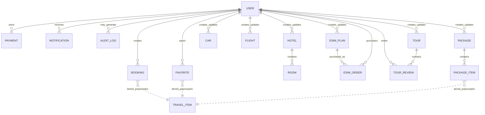

# SAFARNI Database Reference

**Verification basis:** current `security/hardening-v1` Mongoose models and the booking/package services that implement cross-model relationships.

**Purpose:** implementation-grounded database documentation for the graduation report, ERD, data dictionary, API documentation, and deployment review. This describes the current code model only; it does not claim production database state or record counts.

## 1. Database overview

- Database technology: MongoDB
- ODM: Mongoose
- Verified Mongoose models: **14**
- Primary identifier for Mongoose documents: MongoDB `_id` (`ObjectId`)
- Most models use Mongoose `timestamps: true`, which adds `createdAt` and `updatedAt`.
- SAFARNI uses both direct Mongoose `ObjectId` references and polymorphic string identifiers.
- There is **no separate `PackageBooking` Mongoose model** in the reviewed implementation. Package bookings are represented by multiple `Booking` documents sharing the generated string field `packageBookingId`.

## 2. Model inventory

| Model | Primary purpose | Important relationships |
|---|---|---|
| `User` | Customer, provider, and administrator accounts | Parent/owner of bookings, payments, favorites, notifications, service listings and eSIM plans |
| `Tour` | Tour inventory and embedded reviews | `createdBy`/`updatedBy` -> User; `reviews.userId` -> User |
| `Hotel` | Hotel inventory | `createdBy`/`updatedBy` -> User; parent of Room |
| `Room` | Bookable hotel room inventory | `hotelId` -> Hotel |
| `Car` | Rental car inventory | `createdBy`/`updatedBy` -> User |
| `Flight` | Flight inventory | `createdBy`/`updatedBy` -> User |
| `Package` | Curated/provider combination of travel inventory | `createdBy`/`updatedBy` -> User; polymorphic `items.itemId` |
| `Booking` | Customer reservation record | `userId` -> User; polymorphic `itemId`; optional package grouping ID |
| `Payment` | Stripe payment and refund persistence | `userId` -> User; string target IDs for booking/package/eSIM order |
| `ESIMPlan` | Provider/admin eSIM plan inventory | `createdBy`/`updatedBy` -> User |
| `ESIMOrder` | Customer eSIM purchase/provisioning state | `userId` -> User; `planId` -> ESIMPlan |
| `Favorite` | User saved travel item | `userId` -> User; polymorphic `itemId` |
| `Notification` | User-facing operational notifications | `userId` -> User; optional string `relatedId` |
| `AuditLog` | Administrative/API audit trail | optional `userId` -> User |

## 3. Relationship diagram



`TRAVEL_ITEM` in the diagram is a conceptual union of Tour, Hotel/Room, Car, and Flight. It is **not** a MongoDB collection.

## 4. User

Model: `User`

Core fields:

| Field | Type | Rules / meaning |
|---|---|---|
| `name` | String | Required, trimmed |
| `email` | String | Required, unique, lowercase, trimmed, email-like pattern |
| `password` | String | Required, excluded from normal query selection |
| `isVerified` | Boolean | Default `false` |
| `role` | String enum | `user`, `provider`, `admin`; default `user` |
| `providerType` | String enum | Optional: `travel`, `telecom`, `both` |
| `passwordResetToken` | String | Hidden from normal query selection |
| `passwordResetExpires` | Date | Hidden from normal query selection |
| `emailVerificationToken` | String | Hidden from normal query selection |
| `emailVerificationExpires` | Date | Hidden from normal query selection |
| `refreshTokenVersion` | Number | Default `0`; used for refresh-token revocation/rotation |
| `profilePicture` | Embedded object | `{ url, publicId }` |

The model's JSON transform removes password/reset/verification/token-version fields before serialization.

## 5. Travel inventory

### 5.1 Tour

Important fields include `title`, unique `slug`, `summary`, `fullDescription`, `mainImage`, `gallery`, `startDates`, `duration`, `highlights`, `activities`, `locations`, `priceTiers`, inclusion/exclusion lists, cancellation policy, languages, difficulty, provider information, reviews, tags, `recommended`, ownership fields, and approval status.

Approval status: `pending | approved | rejected`.

Embedded review shape:

```text
reviews[]
  userId -> User ObjectId
  rating
  comment?
```

Indexes include location city, recommended flag, approval status, and a text index over title/summary/tags.

### 5.2 Hotel

Core fields: `name`, optional description, rating (0-5), embedded location, amenities, gallery, policies, `createdBy`, `updatedBy`, and approval status.

Indexes include city, rating, text search over name/description, and status + creator.

### 5.3 Room

Core fields:

- `hotelId` -> Hotel ObjectId
- `name`
- `occupancy.adults`
- `occupancy.children` (default 0)
- `pricePerNight`
- `refundable` (default false)
- `amenities[]`

A room is the actual hotel booking target used by booking/package logic; the service resolves its parent Hotel to determine the provider owner.

### 5.4 Car

Core fields: brand, model, optional year, car type, transmission, fuel type, seats, `pricePerDay`, availability, embedded location, optional image, ownership fields, and approval status.

Enums:

- Type: `SUV | Sedan | Hatchback | Convertible | Luxury`
- Transmission: `Automatic | Manual`
- Fuel: `Petrol | Diesel | Electric | Hybrid`
- Status: `pending | approved | rejected`

### 5.5 Flight

Core fields: airline, unique flight number, departure/arrival airport, departure/arrival time, price, available seats, cabin class, ownership fields, and approval status.

Cabin class: `Economy | Business | First`.

The implementation defines a compound index over departure airport, arrival airport, and departure time.

## 6. Package

A Package combines at least two travel items at the validation layer and persists:

- title/description
- cover image and gallery
- country/cities/tags
- optional package type
- optional duration label
- `items[]`
- `discountPercentage`
- calculated `estimatedOriginalPrice`
- `featured`
- optional `validUntil`
- `sourceType`
- ownership fields
- approval status

`sourceType`: `provider | curated`.

`packageType`: `family | couples | luxury | budget | adventure | business`.

Each persisted package item is:

```text
category: tours | hotels | cars | flights
itemId: string
order: number
```

`itemId` is deliberately polymorphic rather than a fixed Mongoose `ref`. For hotel packages the service interprets the item ID as a **Room** ID and resolves its parent Hotel.

## 7. Booking

Core fields:

| Field | Type | Meaning |
|---|---|---|
| `userId` | ObjectId -> User | Customer who created the booking |
| `category` | enum | `tours`, `flights`, `cars`, `hotels` |
| `itemId` | String | Polymorphic travel inventory identifier |
| `packageBookingId` | String, optional | Groups several Booking documents created as one package transaction |
| `startDate` | Date | Reservation start |
| `endDate` | Date | Reservation end |
| `totalPrice` | Number | Calculated booking price after package discount where applicable |
| `status` | enum | `pending`, `confirmed`, `cancelled` |
| `details` | Mixed | Category-specific booking information |

Indexes: `userId`, `status`, and `category`.

### Package booking representation

The current service does not create a separate package-booking document. It generates:

```text
pkg_<timestamp>_<userId>
```

and writes that same value to each participating Booking document. The package operation then returns `{ packageBookingId, bookings }`.

This is therefore a **logical one-to-many grouping**, not an ObjectId reference to another collection.

## 8. Payment

The Payment model persists Stripe payment state and refund records.

Core fields:

- `userId` -> User ObjectId
- exactly one logical target is supplied by API validation: `bookingId`, `packageBookingId`, or `esimOrderId`
- `amount`
- `currency` (default `usd`)
- unique required `stripePaymentIntentId`
- optional `stripeCheckoutSessionId`
- `status`: `pending | succeeded | failed`
- embedded `refunds[]`

Refund item:

```text
bookingId
amount
stripeRefundId
createdAt
```

Indexes include user, unique sparse Checkout Session ID, and target + status indexes for booking/package/eSIM lookup.

The booking/package/eSIM target fields are stored as strings rather than Mongoose ObjectId references.

## 9. eSIM

### 9.1 ESIMPlan

Fields: name, country, optional region, data amount/unit, validity days, price, currency, ownership fields, and approval status.

Data unit: `MB | GB | Unlimited` (default `GB`).

Status: `pending | approved | rejected`.

Indexes: country, region, status.

### 9.2 ESIMOrder

Core relations:

- `userId` -> User ObjectId
- `planId` -> ESIMPlan ObjectId

The order stores a `planSnapshot` so customer order history can retain the purchased plan attributes independently of later plan edits.

Order status: `pending | processing | completed | failed | cancelled`.

Optional provisioned profile contains ICCID, activation code, QR code, SMDP address, profile status, and optional expiry date.

Profile status: `ready | activated | expired | suspended`.

Optional `packageBookingId` is a string linking the order logically to a package-booking group.

Indexes: user, order status, plan.

## 10. Favorite

Fields:

- `userId` -> User
- `category`: `tours | hotels | cars | flights`
- polymorphic `itemId`

A unique compound index on `(userId, category, itemId)` prevents a user from saving the same item twice.

## 11. Notification

Fields:

- `userId` -> User
- `title`
- `message`
- notification type
- `isRead` (default false)
- optional `relatedId` string

Types:

- `booking_created`
- `booking_status_changed`
- `service_approved`
- `service_rejected`

Index: `(userId, isRead)` for inbox/unread queries.

## 12. AuditLog

Fields:

- optional `userId` -> User
- `userEmail` (defaults to `anonymous`)
- HTTP `method`
- request `path`
- response `statusCode`
- `success`
- timestamps

This model records API/audit metadata rather than request bodies, aligning with the backend middleware rule that request bodies are not logged because they may contain passwords, payment metadata, or PII.

## 13. Ownership and approval pattern

Provider-created inventory follows a repeated ownership model:

```text
createdBy -> User
updatedBy -> User
status -> pending / approved / rejected
```

This pattern appears on Tour, Hotel, Car, Flight, Package, and ESIMPlan. Service-layer authorization then limits provider mutations to resources they own, while administrators can approve/reject records.

## 14. Polymorphic-reference design

Three important relationships are implemented with string IDs rather than Mongoose `ref` fields:

1. `Booking.itemId` - target depends on `Booking.category`.
2. `Favorite.itemId` - target depends on `Favorite.category`.
3. `Package.items[].itemId` - target depends on item category; hotel-package entries are interpreted as Room IDs by package logic.

Payment target IDs and `packageBookingId` are also strings.

This flexibility lets a common Booking/Payment/Favorite model support multiple service categories, but referential integrity for these fields is enforced by application services rather than MongoDB/Mongoose population.

## 15. Integrity and indexing notes

Verified database-level protections include:

- unique User email
- unique Tour slug
- unique Flight flight number
- unique Payment `stripePaymentIntentId`
- unique sparse Payment `stripeCheckoutSessionId`
- unique Favorite `(userId, category, itemId)` combination
- multiple query indexes for booking, travel search, eSIM, package, notification, and payment paths

Application-level validation and services add additional constraints such as booking date ordering, travel item existence, provider ownership, approval state, payment confirmation before booking confirmation, availability/capacity checks, and package rollback behavior.

## 16. Documentation boundary

This reference proves the **implemented schema definitions and relationships in source code**. It does not prove:

- production MongoDB deployment or cluster topology
- production record counts or storage size
- backup/restore configuration
- MongoDB Atlas configuration
- live index creation on a deployed database
- database migration history

Those require runtime/deployment evidence and should be documented separately if later verified.
