# SAFARNI UML, Use-Case, Activity, and Sequence Diagrams

**Verification basis:** current SAFARNI hardening branches and the implementation documented in `API_REFERENCE.md`, `DATABASE_REFERENCE.md`, `ARCHITECTURE.md`, and `REQUIREMENTS_TRACEABILITY_MATRIX.md`.

These diagrams describe implemented source-level behavior. External service calls are shown only where the code contains the integration. A diagram does not by itself claim production deployment or live external-service verification.

---

# 1. Actors and system use cases

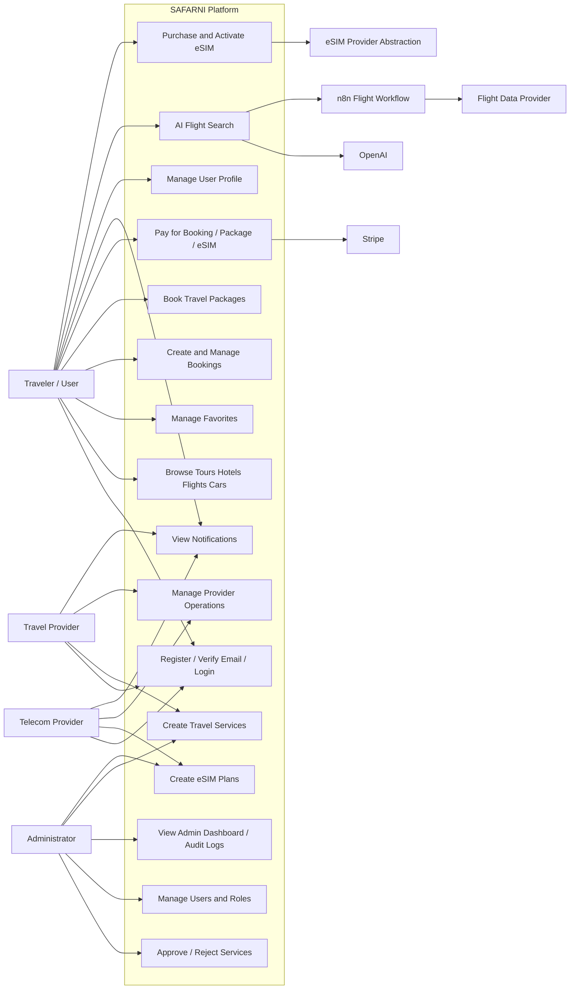

## Actor responsibilities

| Actor | Verified responsibilities |
|---|---|
| Traveler/User | Search/browse, favorites, booking, package booking, payment, eSIM purchase, profile, notifications, AI flight search |
| Travel Provider | Create/manage permitted travel services, manage owned bookings, view provider dashboard/operations |
| Telecom Provider | Create/manage eSIM plans and provider operations |
| Administrator | User/role administration, service approval, booking administration, dashboards, audit logs, diagnostics |
| Stripe | Hosted Checkout/payment processing and webhook events |
| OpenAI | Structured extraction of flight-search intent from natural-language request |
| n8n | Flight-search workflow orchestration |
| Flight Data Provider | Returns external flight offers through the n8n workflow |
| eSIM Provider Abstraction | Provisioning interface; current verified concrete provider is mock |

---

# 2. Authentication activity diagram

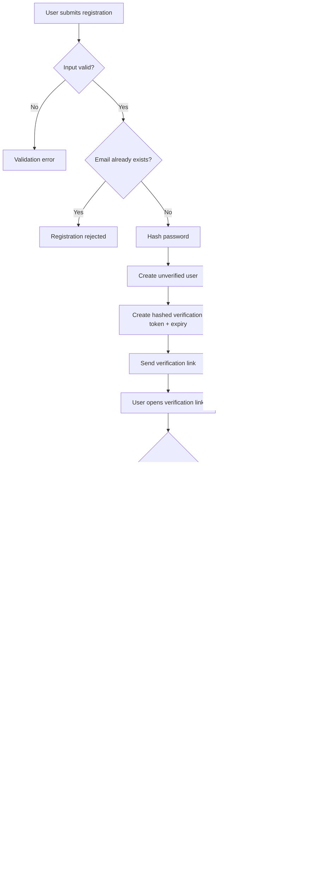

---

# 3. Login/session sequence

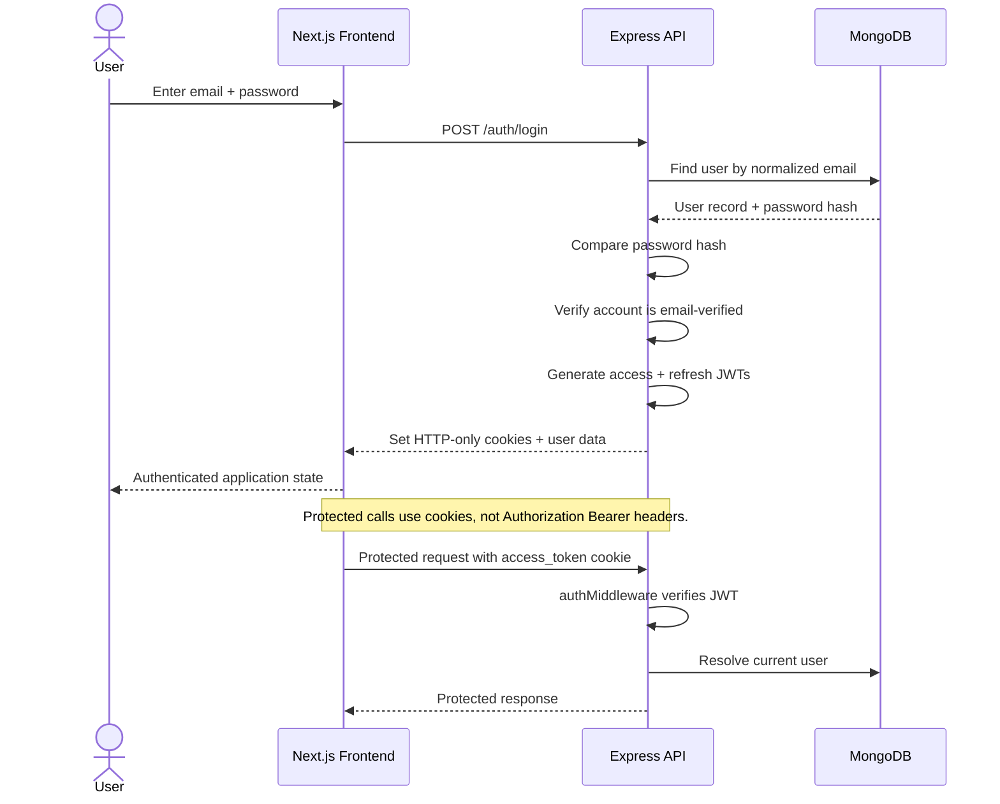

---

# 4. Single booking activity diagram

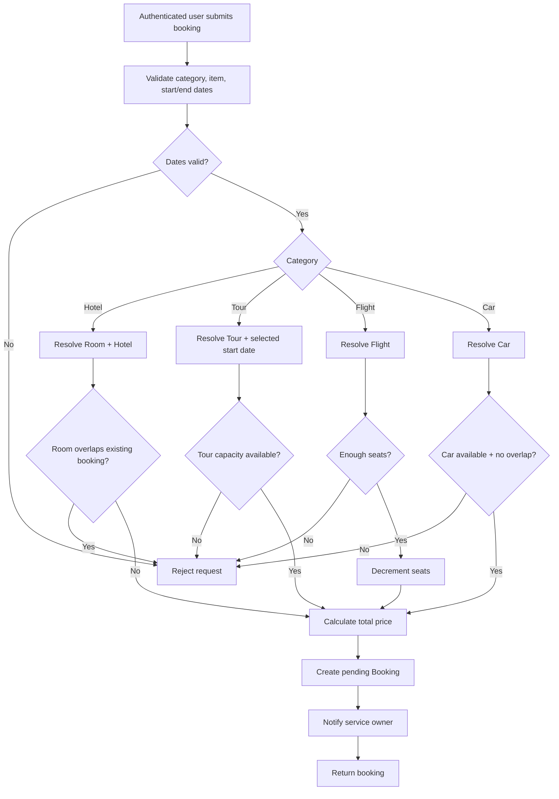

---

# 5. Booking + hosted Stripe checkout sequence

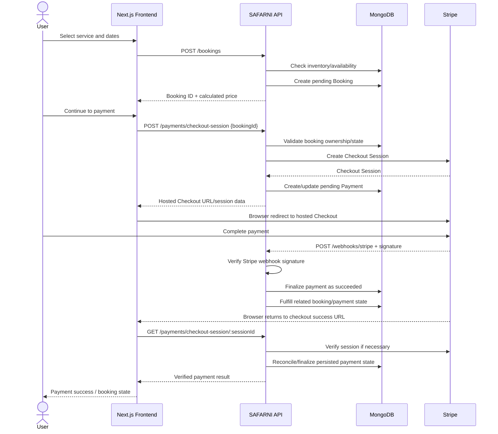

---

# 6. Booking cancellation/refund sequence

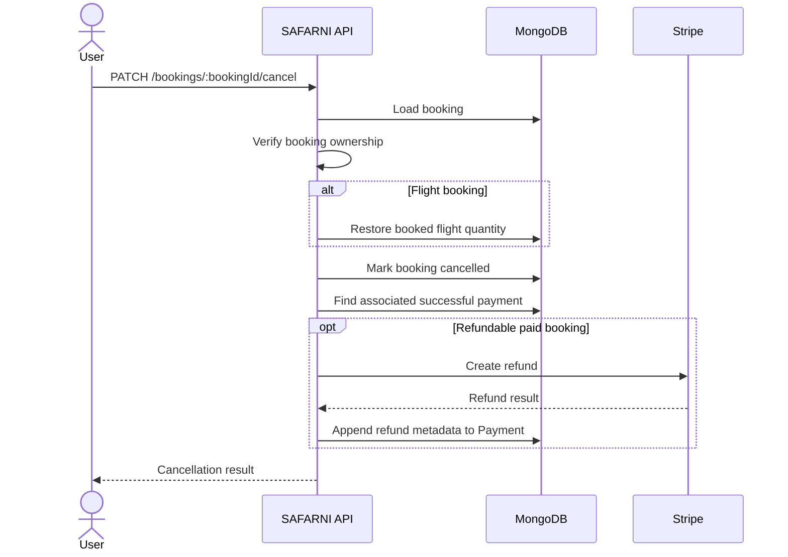

---

# 7. Package booking sequence

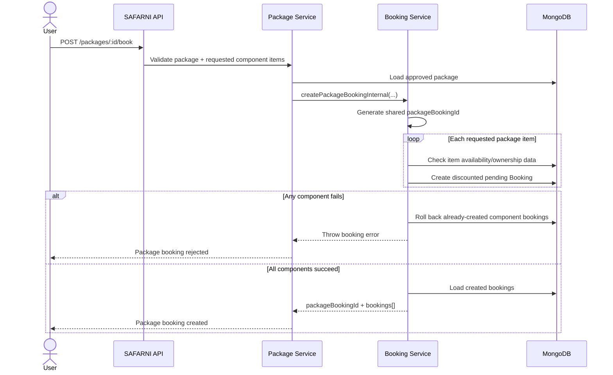

> `packageBookingId` is a grouping string stored on the individual Booking documents. The verified implementation does not define a separate PackageBooking collection.

---

# 8. Service-provider approval sequence

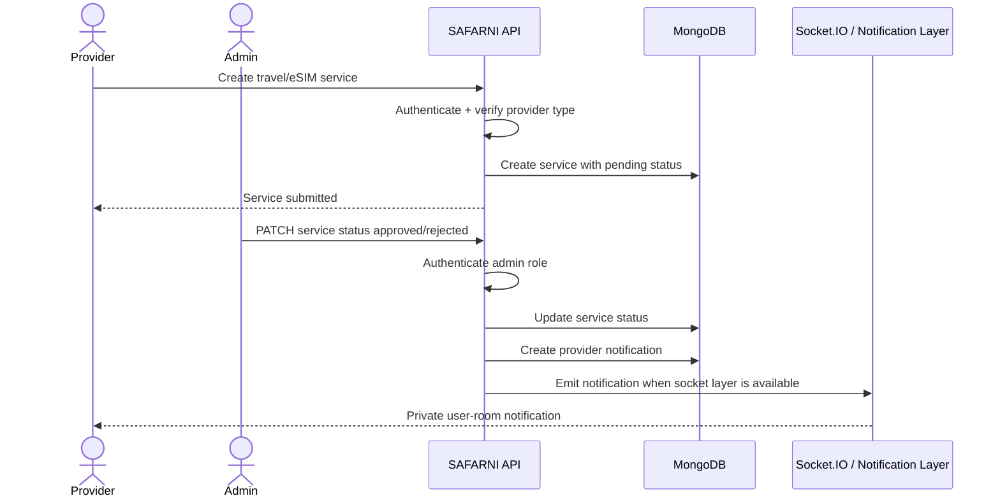

---

# 9. Notification sequence

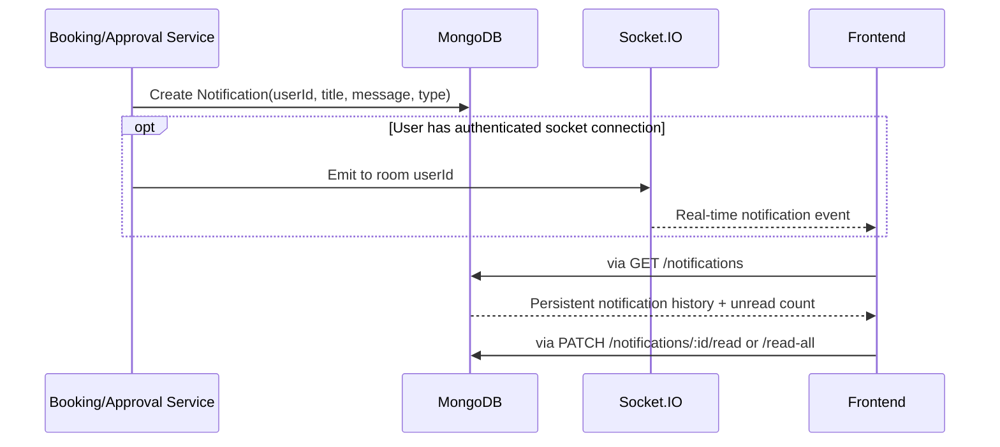

---

# 10. AI flight-search activity diagram

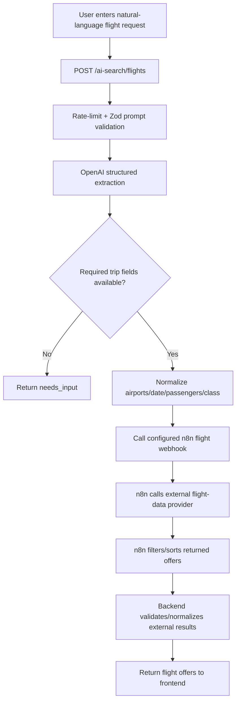

---

# 11. AI flight-search sequence

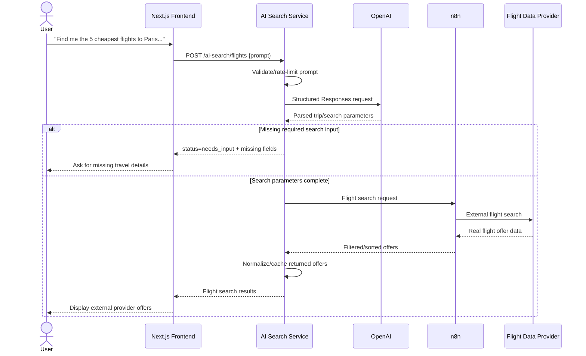

> The AI component interprets the request; prices and flight offers come from the external flight-data workflow rather than being generated by the language model.

---

# 12. eSIM purchase/provisioning activity diagram

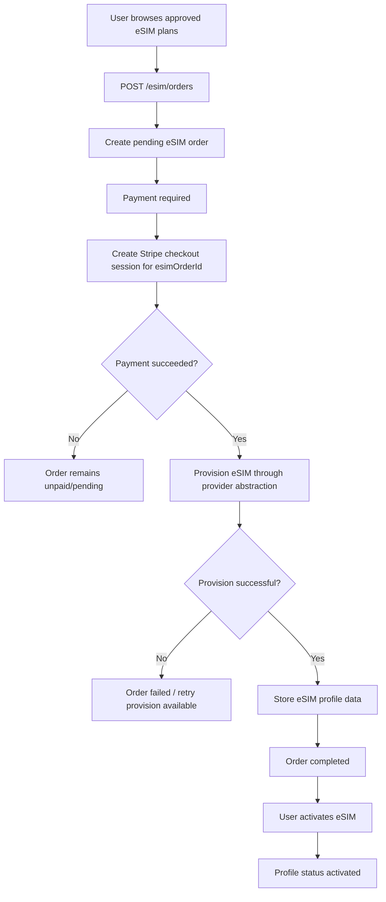

---

# 13. eSIM provisioning sequence

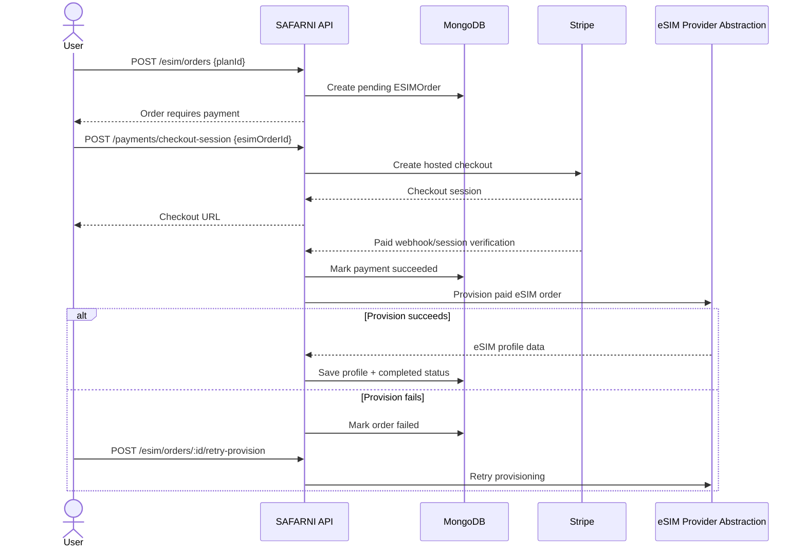

> Current verified concrete provider is a mock provider. This sequence represents the implemented provider abstraction and order/payment lifecycle, not a claim of live carrier integration.

---

# 14. Admin governance sequence

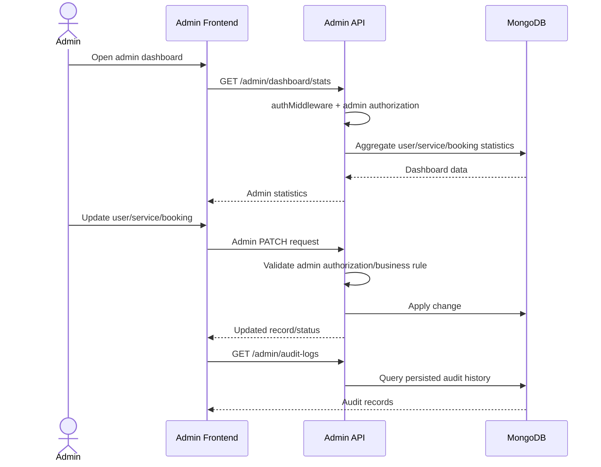

---

# 15. Deployment component diagram

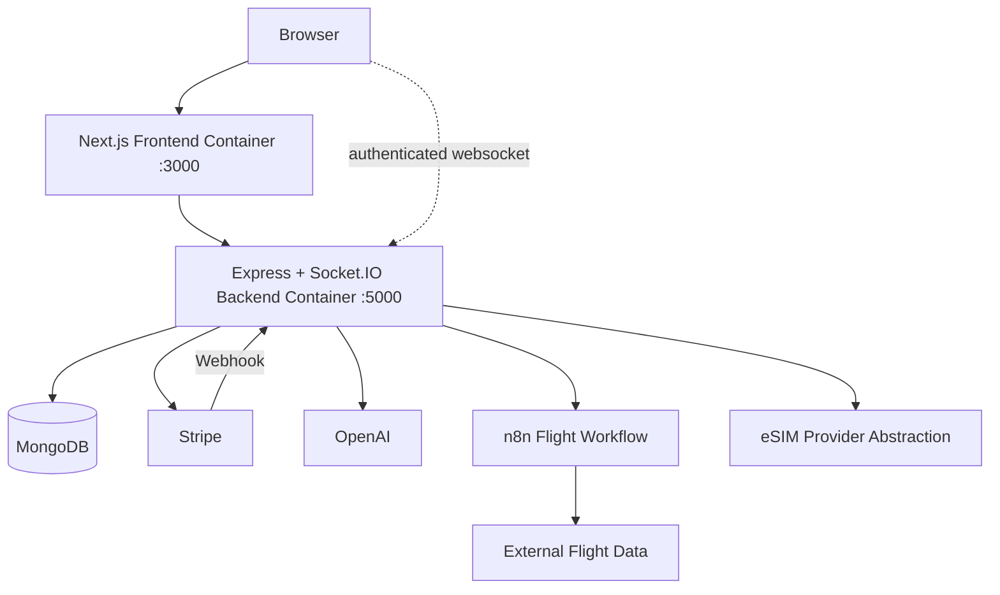

The repository additionally contains Dockerfiles, Kubernetes manifests and GitHub Actions build/audit/container validation. No public cloud provider or production URL is asserted by this diagram.

---

# 16. Diagram-to-requirement traceability

| Diagram | Primary requirements |
|---|---|
| Actors/use cases | FR-01 through FR-34 overview |
| Authentication activity/sequence | FR-01–FR-05, NFR-01–NFR-05 |
| Booking activity | FR-09–FR-12 |
| Booking + Stripe | FR-20–FR-24 |
| Package booking | FR-13 |
| Provider approval | FR-07, FR-08, FR-15, FR-16 |
| Notification flow | FR-15, FR-16 |
| AI flight search | FR-28–FR-32 |
| eSIM purchase/provisioning | FR-25–FR-27 |
| Admin governance | FR-18, FR-32, FR-34 |
| Deployment component | DEV-01–DEV-15 |
